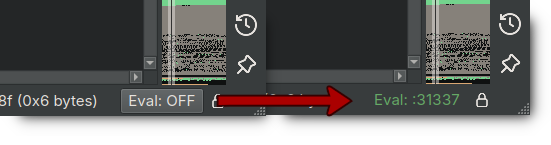

# bn.py - Binary Ninja CLI

Exposes Binary Ninja API as a CLI tool for plug and play with LLMs/agents.

## Setup

1. Copy or symlink the plugin to Binary Ninja:
   ```bash
   ln -s $(pwd)/binja_eval_server.py ~/.binaryninja/plugins/
   # or:
   cp binja_eval_server.py ~/.binaryninja/plugins/
   ```

2. Restart Binary Ninja. Click "Eval" in the status bar to start the server.

   

## CLI Usage

```bash
./bn.py funcs -p main             # Search functions by pattern
./bn.py d 0x401000                # Disassemble function
./bn.py hlil my_func              # High-level IL
./bn.py xrefs 0x401000 -c         # Cross-references (grouped)
./bn.py strings -p password       # Search strings
./bn.py rename 0x401000 foo       # Rename function
./bn.py eval 'len(bv.functions)'  # Run arbitrary Python
```

Use `-P PORT` to connect to a different server (for multiple open binaries).

## Commands

Run `./bn.py --help` for full command list.

## Design / Limitations

The eval server approach allows quick iteration on analysis scripts without reloading plugins - just edit and re-run from the command line. Now that the commands have been decently refined they could probably be moved into the plugin.

It's easy to unintentially run/create requests that will take a long time to finish and there isn't a good way to cancel or have them timeout. Unfortunately this means either waiting for them to complete or restarting binja.

## Demo

Now turn Claude Code loose on moderately difficult [crackme](https://crackmes.one/crackme/695516b4c7e2397e5ac65b2f):

https://github.com/user-attachments/assets/01f5b7f3-7acb-40fb-b395-ceeaefabbc2c
